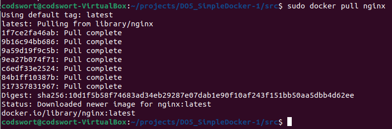
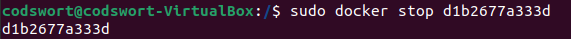
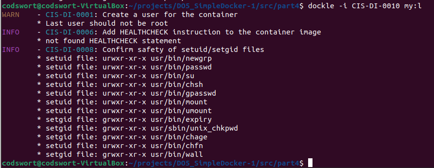

# Simple Docker

## Part 1. Готовый докер

- Взять официальный докер образ с nginx и выкачать его при помощи `docker pull`\
\
Рис.1 Вывод команды `sudo docker pull nginx`

- Проверить наличие докер образа через `docker images`\
\
Рис.2 Вывод команды `sudo docker images`

- Запустить докер образ через docker run -d [image_id|repository]\
\
Рис.3 Вывод команды `sudo docker run -d a6bd71f48f68`

- Проверить, что образ запустился через `docker ps`\
\
Рис.4 Вывод команды `sudo docker ps`

- Посмотреть информацию о контейнере через `docker inspect [container_id|container_name]`\
\
Рис.5 Вывод команды `sudo docker inspect d1b2677a333d`

- По выводу команды определить и поместить в отчёт размер контейнера, список замапленных портов и ip контейнера\
\
Рис.6 Фрагмент вывода команды `sudo docker inspect d1b2677a333d`  
По рис.6 видно, что у контейнера отсутствуют замапленные порты ("Ports": {"80/tcp": null}),
ip-адрес: 172.17.0.2.  
По выводу команды в вышеуказанном виде не виден размер контейнера, однако по с флагом "-s" можно увидеть интересующий нас размер.\
\
Рис.7 Фрагмент вывода команды `sudo docker inspect -s d1b2677a333d`

- Остановить докер образ через `docker stop [container_id|container_name]`\
\
Рис.8 Вывод команды `sudo docker stop d1b2677a333d`

- Проверить, что образ остановился через `docker ps`\
\
Рис.9 Вывод команды `sudo docker ps`

- Запустить докер с портами 80 и 443 в контейнере, замапленными на такие же порты на локальной машине, через команду `run`\
\
Рис.10 Вывод команды `sudo docker run -p 443:443 -p 80:80 -d nginx`  
Здесь:  
-p 80:80 маппит порт 80 контейнера на порт 80 локальной машины;  
-p 443:443 маппит порт 443 контейнера на порт 443 локальной машины;  
nginx - название докер-образа.

- Проверить, что в браузере по адресу localhost:80 доступна стартовая страница nginx\
\
Рис.11 Страница в браузере по адресу localhost:80

- Перезапустить докер контейнер через `docker restart [container_id|container_name]`\
\
Рис.12 Вывод команды `sudo docker restart 27456ab44958`

- Проверить любым способом, что контейнер запустился\
Для того, чтобы убедиться, что контейнер запущен можно передать команду `sudo docker inspect -f '{{ .State.StartedAt }}' 27456ab44958`.
\
Рис.13 Вывод команды `sudo docker inspect -f '{{ .State.StartedAt }}' 27456ab44958`

## Part 2. Операции с контейнером

- Прочитать конфигурационный файл nginx.conf внутри докер контейнера через команду exec\
\
Рис.14 Вывод команд `sudo docker exec -it 27456ab44958 bash` и  `cat /etc/nginx/nginx.conf`

- Создать на локальной машине файл nginx.conf\
- Настроить в нем по пути /status отдачу страницы статуса сервера nginx\
\
Рис.15 Содержимое файла nginx.conf с настроенной отдачей страницы статуса сервера nginx по пути /status

- Скопировать созданный файл nginx.conf внутрь докер образа через команду docker cp\
\
Рис.16 Вывод команды `sudo docker cp nginx.conf 27456ab44958:/etc/nginx/nginx.conf`

- Перезапустить nginx внутри докер образа через команду exec\
\
Рис.17 Вывод команды `sudo docker exec -it 27456ab44958 nginx -s reload`

- Проверить, что по адресу localhost:80/status отдается страничка со статусом сервера nginx\
\
Рис.18 Страница в браузере по адресу localhost/status

- Экспортировать контейнер в файл container.tar через команду export\
\
Рис.19 Вывод команды `sudo docker export -o container.tar 27456ab44958`

- Остановить контейнер\
\
Рис.20 Вывод команды `sudo docker export -o container.tar 27456ab44958`

- Удалить образ через docker rmi [image_id|repository], не удаляя перед этим контейнеры\
Вышеуказанная команда без опций не позволяет удалить образ без удаления контейнера. Для удаления образа без удаления контейнера перед этим необходимо использовать опцию "-f"
\
Рис.21 Вывод команды `sudo docker rmi a6bd71f48f68`

- Удалить остановленный контейнер\
Для того, чтобы узнать идентификатор остановленных контейнеров можно воспользоваться командой `sudo docker ps -a`. Для удаления контейнера используется команда `sudo docker rm [container_id]`\
\
Рис.22 Вывод команд `sudo docker ps -a` и `sudo docker rm 27456ab44958`

- Импортировать контейнер обратно через команду import\
\
Рис.23 Вывод команды `sudo docker import container.tar nginx`

- Запустить импортированный контейнер\
\
Рис.24 Вывод команд `sudo docker run -d -p 80:80 -p 443:443 -it nginx bash`, `sudo docker ps`, `sudo docker exec -it quizzical_spence service nginx start`

- Проверить, что по адресу localhost:80/status отдается страничка со статусом сервера nginx\
\
Рис.25 Страница в браузере по адресу localhost/status

## Part 3. Мини веб-сервер

- Написать мини сервер на C и FastCgi, который будет возвращать простейшую страничку с надписью Hello World!\
\
Рис.26 Код мини сервера на С и FastCgi

- Запустить написанный мини сервер через spawn-fcgi на порту 8080\
\
Рис.27 Вывод команды `spawn-fcgi -p 8080 -n ./server`

- Написать свой nginx.conf, который будет проксировать все запросы с 81 порта на 127.0.0.1:8080\
\
Рис.28 Содержимое файла nginx.conf

- Проверить, что в браузере по localhost:81 отдается написанная вами страничка\
\
Рис.29 Запуск nginx\
  \
  Рис.30 Компиляция и запуск мини сервера\
  \
  Рис.31 Страница в браузере по localhost:81

- Положить файл nginx.conf по пути ./nginx/nginx.conf (это понадобится позже)\
\
Рис.32 Создание папки nginx и перенос файла nginx.conf по пути ./nginx/nginx.conf 

## Part 4. Свой докер

- Написать свой докер образ, который:
  1) собирает исходники мини сервера на FastCgi из Части 3
  2) запускает его на 8080 порту
  3) копирует внутрь образа написанный ./nginx/nginx.conf
  4) запускает nginx.\
  \
  Рис.33 Содержимое Dockerfile

- Собрать написанный докер образ через docker build при этом указав имя и тег\
\
Рис.34 Фрагмент вывода команды `sudo docker build -t my:l .`

- Проверить через docker images, что все собралось корректно\
\
Рис.35 Вывод команды `sudo docker images`

- Запустить собранный докер образ с маппингом 81 порта на 80 на локальной машине и маппингом папки ./nginx внутрь контейнера по адресу, где лежат конфигурационные файлы nginx'а (см. Часть 2)\
\
Рис.36 Вывод команды `sudo docker run -p 80:81 -v $(pwd)/nginx:/etc/nginx -d my:l`

- Проверить, что по localhost:80 доступна страничка написанного мини сервера\
\
Рис.37 Страница в браузере localhost:80

- Дописать в ./nginx/nginx.conf проксирование странички /status, по которой надо отдавать статус сервера nginx\
\
Рис.38 Содержимое файла nginx.conf

- Перезапустить докер образ\
Для того, чтобы перезапустить образ необходимо остановить, удалить запущенный контейнер командами: `sudo docker stop container_id`, `sudo docker rm container_id`

- Проверить, что теперь по localhost:80/status отдается страничка со статусом nginx\
\
Рис.39 Страница в браузере localhost:80/status

## Part 5. Dockle

- Просканировать образ из предыдущего задания через dockle [image_id|repository]\
Сначала необходимо установить docle.\
\
Рис.40 Вывод команды `dockle my:l`

- Исправить образ так, чтобы при проверке через dockle не было ошибок и предупреждений\
Несмотря на многократные попытки избавиться от ошибки "FATAL - CIS-DI-0010", этого не удалось добиться. В связи с этим было принято решение добавить флаг "-i CIS-DI-0010".\
\
Рис.41 Вывод команды `dockle -i CIS-DI-0010 my:l`
Как видно, пользователь не должен быть root. Поэтому нужно скорректировать Dockerfile.
\
Рис.42 Содержимое Dockerfile после корректировки\
Теперь можно пересобирать докер образ с помощью команды `sudo docker build -t my:l .`, и еще раз проверить с помощью dockle.\
\
Рис.43 Вывод команды `dockle -i CIS-DI-0010 my:l` после корректировки Dockerfile.

## Part 6. Базовый Docker Compose

- Написать файл docker-compose.yml, с помощью которого:

  1) Поднять докер контейнер из Части 5 (он должен работать в локальной сети, т.е. не нужно использовать инструкцию EXPOSE и мапить порты на локальную машину)  
  \
  Рис.44 Содержимое Dockerfile для первого контейнера.

  2) Поднять докер контейнер с nginx, который будет проксировать все запросы с 8080 порта на 81 порт первого контейнера
  \
  Рис.45 Содержимое Dockerfile для второго контейнера.

  \
  Рис.46 Содержимое nginx.conf.

- Замапить 8080 порт второго контейнера на 80 порт локальной машины\
\
Рис.47 Содержимое docker-compose.yml.

- Остановить все запущенные контейнеры можно командой `docker stop [CONTAINER ID]`
- Собрать и запустить проект с помощью команд docker-compose build и docker-compose up
\
Рис.48 Вывод команды `docker-compose up -d`

- Проверить, что в браузере по localhost:80 отдается написанная вами страничка, как и ранее
\
Рис.49 Вывод команды `curl localhost:80`